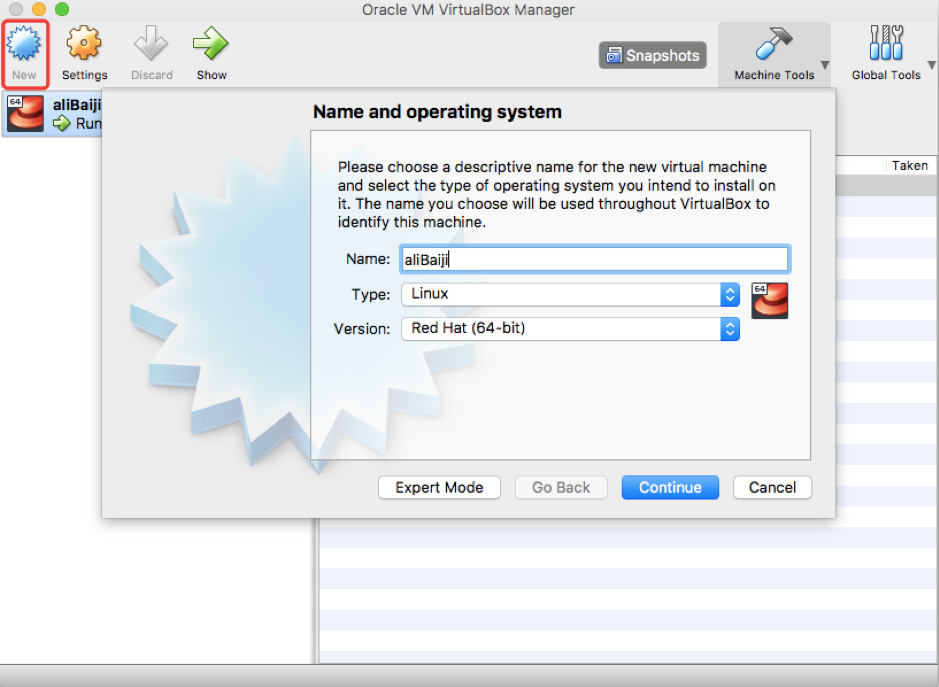
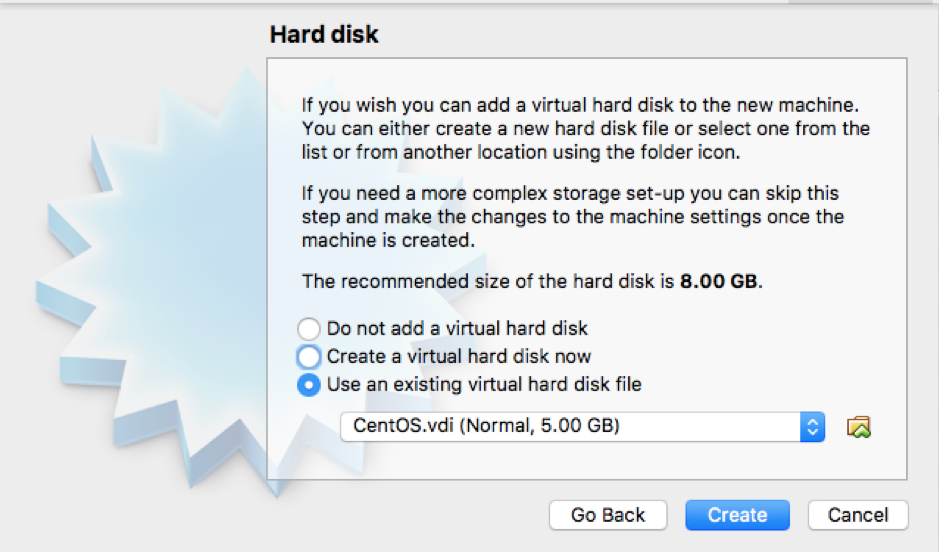
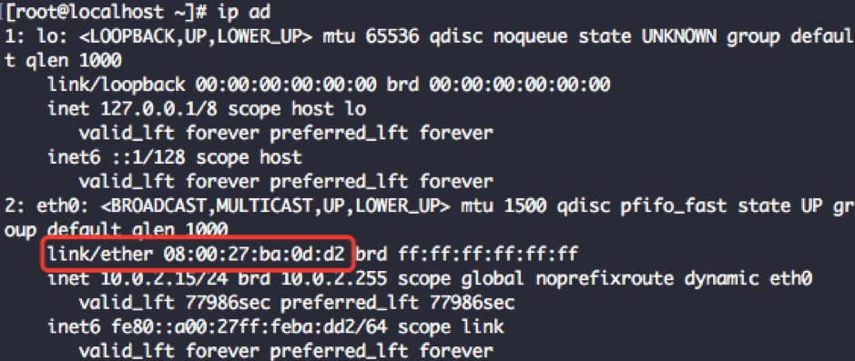
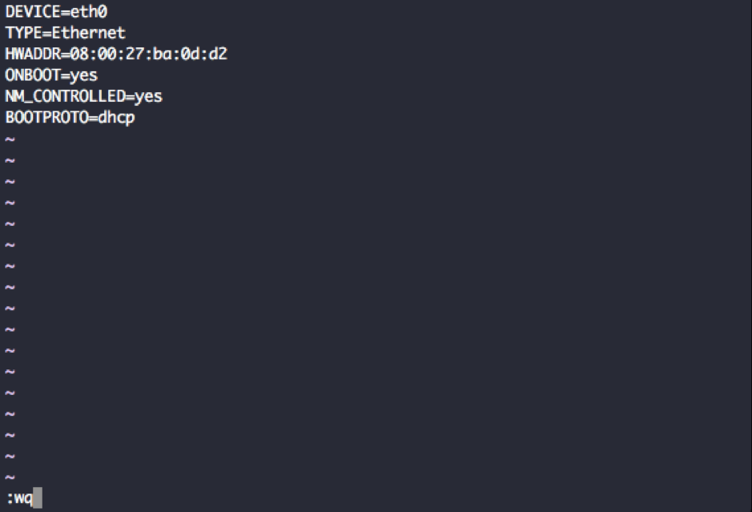
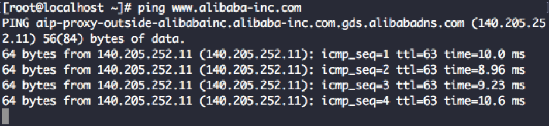
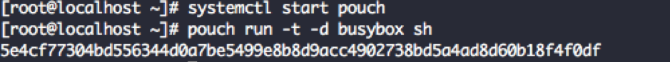

# Enviroment Setup

[TOC]

### Install Golang

1. Create Directories

`mkdir $HOME/Go`

`mkdir $HOME/Go`

`mkdir -p $HOME/Go/src/github.com/user`

 

2. Setup your paths

`export GOPATH=$HOME/Go`

`export GOROOT=/usr/local/opt/go/libexec`

`export PATH=$PATH:$GOPATH/bin`

`export PATH=$PATH:$GOROOT/bin`

 

3.  Install Go

`brew install go`

 

4. "go get" the basics

`go get golang.org/x/tools/cmd/godoc`

 

### Install VS Code

VS Code Download: <https://code.visualstudio.com/download>

 

### PouchContainer Setup

1. Because PouchContainer is an enterprise-class container solution, it only supports the Linux operating system. Users of other operating systems need to use virtual machines to run and test locally. Please follow the steps below to set up the environment.

 

2. VirtualBox Download Link: <https://www.virtualbox.org/wiki/Downloads>

MacOS,  Windows users please click the corresponding link in the above url.

Or DingPan link:

Mac Version：<https://space.dingtalk.com/s/gwHOABma4QLOGlgkPQPaACBiMzk5ZWRjZTAyOGI0MTBkOGRkNTRjYzNkN2Q1NTFjOA>  password: p5Sb

Windows Version：<https://space.dingtalk.com/s/gwHOABmLzwLOGlgkPQPaACBhNzNjYjI5NTYxMzQ0NmUwOWRmMTFlN2UzMTYxNDQ4Mw>  password: V7ms

 

3. Download the virtual machine backup of the development environment:

https://space.dingtalk.com/s/gwHOABmslALOGlgkPQPaACAwNTg4YTBjOG I4OTI0MGQ5YjE5MDgyYWFjMzAxMDY1MQ 密码: tkD3 

 

4. Open VirtualBox: Create a new instance, give whatever name you want to the instance. Choose system type as Linux. Choose version as Red Hat(64-bit).

 

After choosing the system version, click continue to the next step. Set memory size as 1024M.

 

Click continue. Use the virtual disk file download in the last step. The CentOS.vdi file. Click “Create” to create a new instance. Start the new instance, login with users: root, password: Ali88Baiji

 

Use ip ad command to see the MAC address of your machine.

`$ Ip ad`

 

Use vim to modify /etc/sysconfig/network-scripts/ifcfg-eth0 file, modify the HWADDR same as the MAC address showed above. Save and exit.

Reboot and ping [www.alibaba-inc.com](http://www.alibaba-inc.com) to see if the network connection is correct.

 

 

`$ systemctl  start pouch`

Start the pouch service.

`$ pouch run -t -d busybox sh`

Start a busybox basic container.

`$ pouch exec -it {ID} sh`

The ID is the first six characters showed in the last command.

Now, you have successfully start the PouchContainer service.
