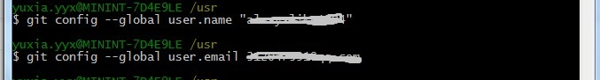
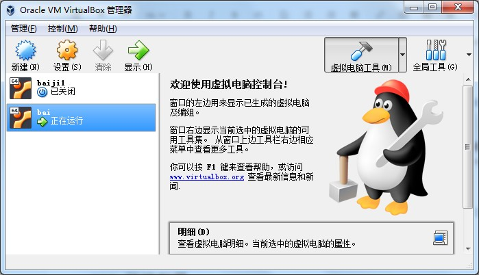
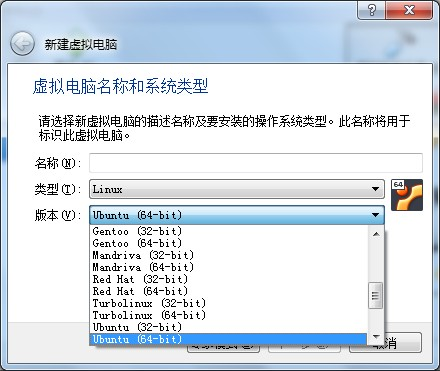
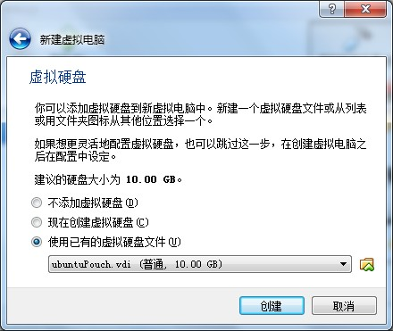
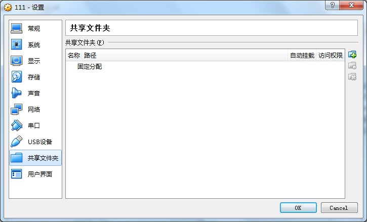
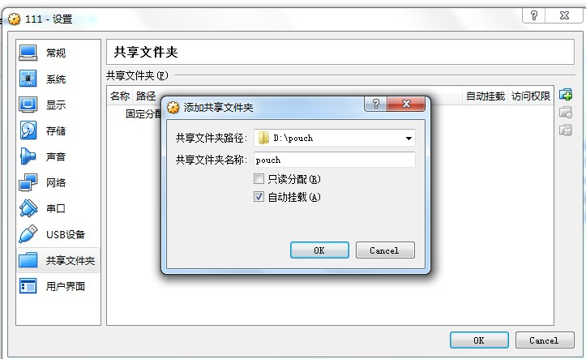
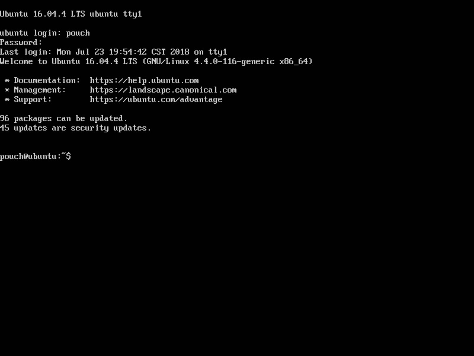
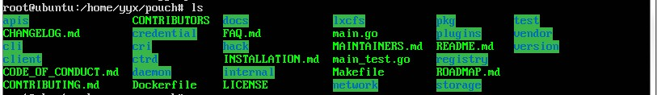

### 必要文件准备
#### 1、pouch源码准备
&nbsp;&nbsp;&nbsp;&nbsp;先从阿里郎下载git，配置git，打开安装目录下的git bash文件，输入下面几条命令：
>git config --global user.name 姓名
>git config --global user.email 邮箱


&nbsp;&nbsp;&nbsp;&nbsp;配置好git的name和email后，使用git clone git://github.com/alibaba/pouch.git 保存在git安装目录下的pouch文件夹内。或者下载一个goland进入官网下载即可，可免费试用30天。通过goland里面的file--settings--Version Control--Git配置好git，再new 一个project from version，通过url拉下这个源码。
#### 2、Virtual Box安装
&nbsp;&nbsp;&nbsp;&nbsp;从阿里郎下载VirtualBox，或者从官网https://www.virtualbox.org/ 直接下载VirtualBox。
#### 3、ubantu64bit安装
&nbsp;&nbsp;&nbsp;&nbsp;打开VirtualBox，新建一个虚拟机，点击新建.。
&nbsp;&nbsp;&nbsp;&nbsp;选择Linux，选择Ubantu（64bit），如果找不到64bit系统支持，进入电脑BIOS设置，进行一下配置。Inter Virtual Technology默认是disable，将它改成enable。然后再次新建一个虚拟机，选择Linux，选择Ubantu（64bit），选择使用已有的虚拟硬盘文件。再运行该虚拟机。

### 环境配置
#### 1、配置GuestAdditions
&nbsp;&nbsp;&nbsp;&nbsp;打开设置的存储，选择控制器，选择分配光驱，选择VBoxGuestAdditions.iso。
#### 2、虚拟机共享和go环境配置
&nbsp;&nbsp;&nbsp;&nbsp;我们现在要把本地环境的pouch代码共享到虚拟机上，打开虚拟机的设置界面，选择共享文件夹。
&nbsp;&nbsp;&nbsp;&nbsp;选择固定分配，选择共享文件夹地址，命名为pouch。勾选自动装载。
&nbsp;&nbsp;&nbsp;&nbsp;启动该虚拟机，用户名输入pouch，密码输入123456。输入sudo -s切换到root用户，输入123456。输入source /etc/profile 配置go环境。

&nbsp;&nbsp;&nbsp;&nbsp;输入mount -t vboxsf 地址名称 虚拟机的路径。在这里我输入mount -t vboxsf pouch /home/yyx/pouch，意思就是把pouch的地址下的东西挂在/home/yyx/pouch下，使虚拟机可以共享pouch下的文件。
&nbsp;&nbsp;&nbsp;&nbsp;然后看看挂成功了没，跳到/home/yyx/pouch下，执行ls。输出如下：

&nbsp;&nbsp;&nbsp;&nbsp;结果表示文件挂成功了。
最后新建一个hello.go，内容见下：
```go
package main //define package name
//import package needed
import (
  "fmt"
  "time"
)
//The main function is required for every executable program
func main() {
  fmt.Println("Welcome to the playground!")

  fmt.Println("The time is", time.Now())
}
```
到文件目录下输入go run hello.go成功输出。

### pouchContainer 使用
&nbsp;&nbsp;&nbsp;&nbsp;执行systemctl start pouch，开启pouch服务，默认（开机启动）。输入pouch run -t -d busybox sh，开启一个busybox pouch容器。输入pouch exec -it xxxxxx sh运行进入这个busybox，六个x表示开启busybox后的结果id前六位。

### 问题总结
&nbsp;&nbsp;&nbsp;&nbsp;这次基于VirtualBox + Ubuntu16.04 的 PouchContainer 体验环境搭建与上手还是比较简单的，但是在实践过程中还是遇到了一些小问题，现在总结如下：
* 虚拟机go环境变量要配置。
* 挂载文件时，如何配置VBoxGuestAdditions.iso。网上有些教程，但其实应该依照本文方法就可以了。
网上教程：https://segmentfault.com/a/1190000004362463
* 容器登录时大括号是不需要的。
* 在mount时注意地址路径和名称的含义。
