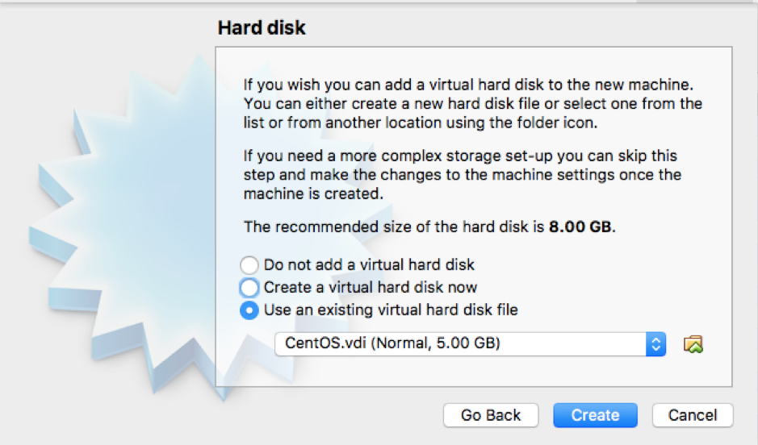
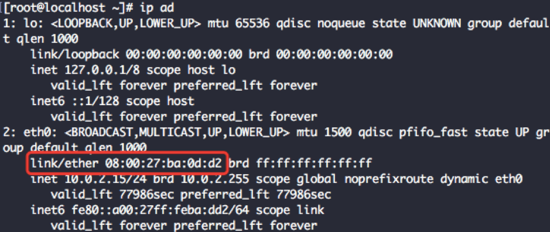
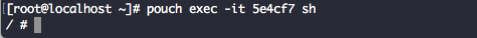

# 环境配置

[TOC]

### 安装 Golang

1. 新建目录

`mkdir $HOME/Go`

`mkdir $HOME/Go`

`mkdir -p $HOME/Go/src/github.com/user`

 

2. 配置路径

`export GOPATH=$HOME/Go`

`export GOROOT=/usr/local/opt/go/libexec`

`export PATH=$PATH:$GOPATH/bin`

`export PATH=$PATH:$GOROOT/bin`

 

3. 安装GO

`brew install go`

 

4. 获取GO

`go get golang.org/x/tools/cmd/godoc`

 

### 安装 VS Code

VS Code 下载地址: <https://code.visualstudio.com/download>

 

### PouchContainer 配置

1. 由于PouchContainer是企业级容器方案，故其只支持Linux操作系统，如果是其它操作系统的用户需要使用虚拟机才能做到本地运行和测试。请依照以下步骤进行环境搭建。 

 

2. VirtualBox 下载地址: <https://www.virtualbox.org/wiki/Downloads>

MacOS,  Windows 用户可以下载对应的地址

或者钉盘地址:

Mac版本：<https://space.dingtalk.com/s/gwHOABma4QLOGlgkPQPaACBiMzk5ZWRjZTAyOGI0MTBkOGRkNTRjYzNkN2Q1NTFjOA>  密码: p5Sb

Windows版本：<https://space.dingtalk.com/s/gwHOABmLzwLOGlgkPQPaACBhNzNjYjI5NTYxMzQ0NmUwOWRmMTFlN2UzMTYxNDQ4Mw>  密码: V7ms

 

3. 下载镜像地址:

https://space.dingtalk.com/s/gwHOABmslALOGlgkPQPaACAwNTg4YTBjOG I4OTI0MGQ5YjE5MDgyYWFjMzAxMDY1MQ 密码: tkD3 

 

4. 打开VirtualBox，新建-名称自定义-类型选择【Linux】-版本选择【Red Hat(64-bit)】

 

-继续-内存选择【1024M】-继续-使用【已有的虚拟硬盘文件】-选择步骤C中下载的vdi文件-创建 

 

 

点击继续，等待进入登录阶段，用户名root,密码Ali88Baiji

 

用ip ad 命令查看本地MAC 地址

`$ Ip ad`

 

修改/etc/sysconfig/network-scripts/ifcfg-eth0，使其中的HWADDR与ip ad命令中显示的MAC地址一致 

 

Reboot后ping [www.alibaba-inc.com](http://www.alibaba-inc.com)，检查网络是否正常 

 

 

`$ systemctl  start pouch`

执行命令systemctl start pouch 启动pouch服务

`$ pouch run -t -d busybox sh`

启动一个busybox基础容器

`$ pouch exec -it {ID} sh`

执行pouch exec -it {ID} sh 登入启动容器，其中ID是上条命令输出的完整ID的前六位

现在你已经成功启动了Pouch容器服务.

 