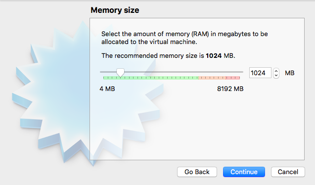
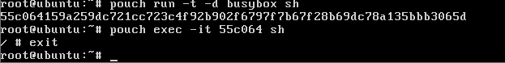
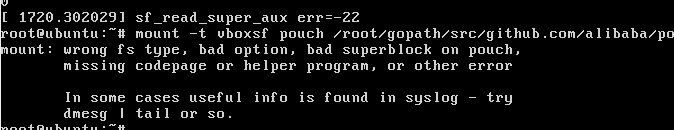

### File Needed
1. Source of pouch
2. Virtual Box
3. Ubuntu Linux
### Environment
#### 1.Fork pouch and clone pouch to local
* Fork a repo to youre account from PouchContainer's github(https://github.com/alibaba/pouch)
* clone pouch repo to local
```bash
git clone https://github.com/youraccount/pouch.git
```
* Configurate username and email
```bash
git config --global user.name "your account"
git config --global user.email "your email address"
```
#### 2.Virtual Box Installation
* download from ALILANG or DingDing
  mac:https://space.dingtalk.com/s/gwHOABma4QLOGlgkPQPaACBiMzk5ZWRjZTAyOGI0MTBkOGRkNTRjYzNkN2Q1NTFjOA  password:p5Sb
  windows:https://space.dingtalk.com/s/gwHOABmLzwLOGlgkPQPaACBhNzNjYjI5NTYxMzQ0NmUwOWRmMTFlN2UzMTYxNDQ4Mw password:V7ms
* install Virtual Box
#### 3.Create Virtual Machine of ubuntu linux
* open Virtual Box and select **New**, input name, select Linux for type, Ubuntu(64-bit) for version.just like the picture.
 
* slect continue,select 1024M for memory size.
 
* select continue,and select Use an existing virtual hard disk file, select the file ubuntuPouch.vdi.
 
* select create to finish and start your virtual machine,input username(default:pouch),password(default:123456)
#### 4.Develop Environment
* open Virtual Box, and select **setting**, select **Shared Folders**, add repo file  which you clone from pouch's github,select path of repo for **Folder Path**, input name for **Folder Name**, please make **Auto-mount** checked or you need to mount manually.select ok.just like the picture.

* change user to root,sudo su and input password.
* mount your directory to PouchContainer's directory(/root/gopath/src/github.com/alibaba/pouch),then you can code in the host machine and run in virtual machine.
```bash
mount -t vboxsf pouch /root/gopath/src/github.com/alibaba/pouch
```
* start pouch service
```bash
systemctl start pouch
```
* start a basic container
```bash
pouch run -t -d busybox sh
```
* login container
```bash
pouch exec -it ID sh
```
ID is top six of the return value of last command.
 
* exit pouch
```bash
exit
```
#### 5.run hello.go
* new Hello.go()
```go
package main //define package name
//import package needed
import (
	"fmt"
	"time"
)
//The main function is required for every executable program
func main() {
	fmt.Println("Welcome to the playground!")

	fmt.Println("The time is", time.Now())
}
```
* run hello.go in virtual machine,the directory of pouch has containered go,git,make,et al.
```bash
cd /root/gopath/src/github.com/alibaba/pouch
go run hello.go
```
 
if you get information like the picture,Congratulation on the success.
### Questions
#### 1.The program 'go' is currently not installed.
 
* You need source profile
```bash
source /etc/profile
```
#### 2.If you can't find the file hello.go
* You need to mount you file 
```bash
mount -t vboxsf pouch /root/gopath/src/github.com/alibaba/pouch
```
#### 3.mount:wrong fs type,bad option,bad superblock on pouch,missing codepage or helper program,or other error.
 
* You need to install VBoxGuestAdditions
```bash
cd /opt/VBoxGuestAdditions-*/init
sudo ./vboxadd setup
```